> 课程名称：计算机体系结构
>
> 实验类型：综合
>
> 实验项目名称：Lab1：Pipelined CPU supporting RISC-V RV32I Instructions
>
> 学生姓名：杨正宇
>
> 专业：计算机科学与技术
>
> 学号：3220104117
>
> 同组学生姓名：
>
> 指导教师：姜晓红
>
> 实验日期：2024.9.22


## 1. 实验目的与要求

- （重新）学会使用Vivado进行硬件设计开发

- 理解 RISC-V RV32I 指令

- 掌握执行 RV32I 指令的流水线 CPU 设计方法

- 掌握流水线Forwarding和Bypass的方法

- 掌握Predict-not-Taken的Stall方法

- 掌握在CPU上执行RISCV程序的方法


## 2. 实验内容和原理

### 2.1 顶层RV32Core连线

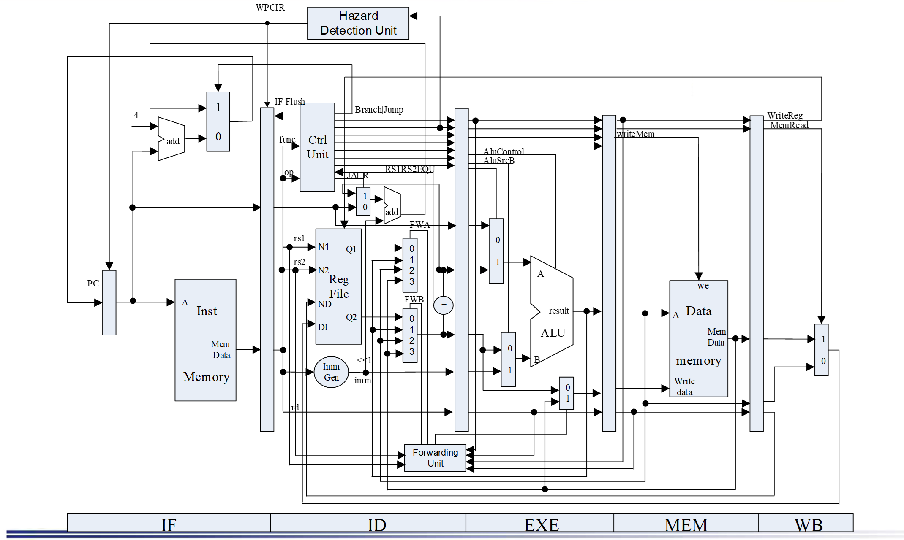

根据这张图进行连接


```verilog
MUX2T1_32 mux_IF(.I0(PC_4_IF),.I1(jump_PC_ID),.s(Branch_ctrl),.o(next_PC_IF));
```

这一部分是选择下一条pc的


```verilog
MUX4T1_32 mux_forward_A(.I0(rs1_data_reg),.I1(ALUout_EXE),.I2(ALUout_MEM),.I3(Datain_MEM),
        .s(forward_ctrl_A),.o(rs1_data_ID));
MUX4T1_32 mux_forward_B(.I0(rs2_data_reg),.I1(ALUout_EXE),.I2(ALUout_MEM),.I3(Datain_MEM),
        .s(forward_ctrl_B),.o(rs2_data_ID));//参考forward_ctrl_A和forward_ctrl_B的定义来填写
```

这一部分是参考图中FWA FWB来填写，是forward的部分，分别是相邻两条指令的rd和rs（非load），间隔一条指令rd和rs（非load），load-use的情况，分别对于I1,I2,I3这三个接口


```verilog
MUX2T1_32 mux_forward_EXE(.I0(rs2_data_EXE),.I1(Datain_MEM),.s(forward_ctrl_ls),.o(Dataout_EXE)); //store的rs2那条线
```

这是管load-store forward的情况的，对映图中exe阶段alu下面的那个2to1多路选择器


### 2.2 Forward实现思路

#### 2.2.1 Forward类型判断

1. 使用上一条的rd，且上一条不是load型指令

```verilog
assign A_EX_Forward = rs1use_ID &  //本条指令有rs1
                        (rs1_ID == rd_EXE) &  //前一条指令的rd等于本条指令的rs1
                        (|rs1_ID) &  //本条指令的rs1不是    0
    (hazard_optype_EX == HAZARD_EX); //上一条存在rd，有EX阶段的冒险

assign B_EX_Forward = rs2use_ID & 
                        (rs2_ID == rd_EXE) & 
                        (|rs2_ID) &
                        (hazard_optype_EX == HAZARD_EX);
```

这个元件是在ID阶段的，因此后缀ID代表本条指令，EX代表上一条指令


2. 使用到上上条的rd，且上上条不是load型指令

3. 使用到上上条的rd，且上上条不是load型指令（load-use）（这个还需要stall）

```verilog
assign A_MEM_Forward = ~(A_EX_Forward) & //double hazard 
                        rs1use_ID &  //本条指令有rs1
                        (rs1_ID == rd_MEM) &  //前前条指令的rd等于本条的rs1
                        (|rs1_ID) & //本条指令的rs1不是0
    (hazard_optype_MEM == HAZARD_EX | hazard_optype_MEM == HAZARD_MEM); //上上条有rd，是alu类型（EX阶段）或者load类型（MEM）的冒险       
assign B_MEM_Forward = ~(B_EX_Forward) & 
                        rs2use_ID & 
                        (rs2_ID == rd_MEM) & 
                        (|rs2_ID) &
                        (hazard_optype_MEM == HAZARD_EX | hazard_optype_MEM == HAZARD_MEM);
```

注意这里要妥善处理double hazard的情况，forward要用最近的


```verilog
assign forward_ctrl_A   = {2{A_EX_Forward}} & 2'b01|
                              {2{A_MEM_Forward&(hazard_optype_MEM==HAZARD_EX)}} & 2'b10 |
                              {2{A_MEM_Forward&(hazard_optype_MEM==HAZARD_MEM)}}& 2'b11 ; //load use

assign forward_ctrl_B   = {2{B_EX_Forward}} & 2'b01|
                              {2{B_MEM_Forward&(hazard_optype_MEM==HAZARD_EX)}} & 2'b10 |
                              {2{B_MEM_Forward&(hazard_optype_MEM==HAZARD_MEM)}}& 2'b11 ;

```

综合一下前面的可以得到ID阶段的forward的选择信号

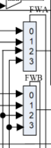

> 注意，load use和上上条指令的rd被用到的情况其实挺像的，判断信号几乎一样，用hazard_optype进行区分

4. load-store

> 这种情况无需stall！！只需要改变数据通路

```verilog
assign ST_Forward = (hazard_optype_EX==HAZARD_ST) &  //当前是st
                    (hazard_optype_MEM==HAZARD_MEM)& //上一条是load
                    (rs2_EXE == rd_MEM) & //当前指令的rs2等于上一条的rd
    					(|rs2_EXE); //之前这里写了ID，感觉不对
```

这个地方的选择信号是给EXE阶段的这个mux的，所以EXE后缀是指当前指令

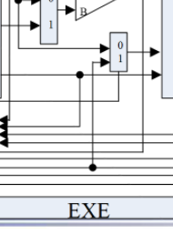


#### 2.2.2 Forward数据通路

其实就是多增加了一些mux，就是2.2.1里面的两张图，RV32Core的代码如下：

```verilog
//alu、load-use forward
MUX4T1_32 mux_forward_A(.I0(rs1_data_reg),.I1(ALUout_EXE),.I2(ALUout_MEM),.I3(Datain_MEM),
        .s(forward_ctrl_A),.o(rs1_data_ID));
MUX4T1_32 mux_forward_B(.I0(rs2_data_reg),.I1(ALUout_EXE),.I2(ALUout_MEM),.I3(Datain_MEM),
        .s(forward_ctrl_B),.o(rs2_data_ID));//参考forward_ctrl_A和forward_ctrl_B的定义来填写

//load-store forward
MUX2T1_32 mux_forward_EXE(.I0(rs2_data_EXE),.I1(Datain_MEM),.s(forward_ctrl_ls),.o(Dataout_EXE)); 
```


#### 2.2.3 Stall的情况

```verilog
wire reg_FD_stall_rs1 = rs1use_ID & (rs1_ID == rd_EXE) & (|rs1_ID) & (hazard_optype_EX == HAZARD_MEM);
wire reg_FD_stall_rs2 = rs2use_ID & (rs2_ID == rd_EXE) & (|rs2_ID) & (hazard_optype_EX == HAZARD_MEM) & (hazard_optype_ID != HAZARD_ST);
   
assign reg_FD_stall = reg_FD_stall_rs1 | reg_FD_stall_rs2;
assign reg_DE_flush = reg_FD_stall;
assign PC_EN_IF = ~reg_FD_stall; //stall的时候pc不更新
```

只有load-use这种需要停顿（load后面马上用）并且注意在rs2那边还要排除load-store的情况，因为这种直接用forward就可以解决，不需要停顿

stall的时候发生这些事情：

1. IF/ID这个寄存器停住，不要传入新的指令（IF得到的指令别往ID传）
2. PC寄存器别刷新PC
3. ID/EX这层，因为发现load-use的时候，load指令跑到了EXE，后面这条跑到了ID阶段，他获得了错误的寄存器内容，这个内容此时在ID/EXE寄存器，因此要将其flush掉


### 2.3 Predict not taken

compare模块放在ID阶段，因此前一条取得跳转类指令，会在ID阶段确认是否跳转，但这样的话，下一条指令会进入到IF阶段，如果需要跳转，就要把IF/ID寄存器给flush掉，如果不跳转，就不用flush，一切照常就行

flush的判断很简单

```verilog
assign reg_FD_flush = Branch_ID;
```


## 3. 实验过程和数据记录以及结果分析

### 3.1 Forward

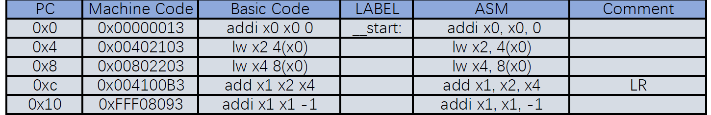

在这一段中


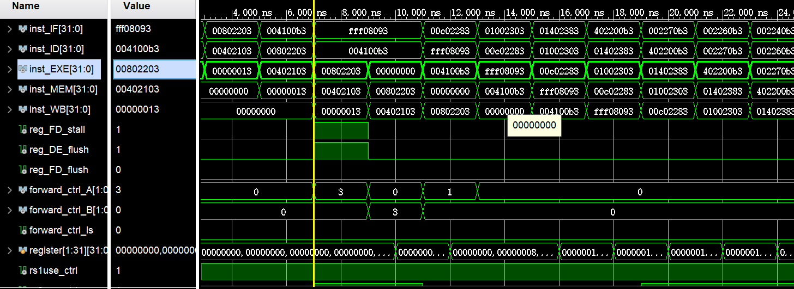


从上往下看，先发生了一个forward然后同时是一个stall，接下来等stall结束后发生第二个forward，然后又发生一个forward

1. load-use forward：出现在lw x2……和add x1,x2,x4上，即rs1和rd。可以看到forward_ctrl_A正确
2. load-use stall：出现在lw x4……和add x1,x2,x4上

可以看到`lw x4,8(x0)`这一条指令运行到EXE阶段时，下一条`add x1,x2,x4`运行到了ID阶段，此时检测到了load-use stall，如图，正确发生了stall，ID阶段的inst不变，ID/EX的内容被flush掉了，此时PC卡住了，IF/ID的内容不变了，EX这段被塞进了一个气泡

3. load-use forward：出现在lw x4……和add x1,x2,x4上，由于插入了气泡，相当于这两条指令又是被隔开了一条，就正常load-use forward

可以看到forward_ctrl_B正确

4. 紧邻两条alu的forward，即这两条add，可以看到rs1那边的信号正确，是1，就是第一种forward


load-store forward

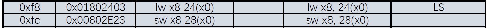


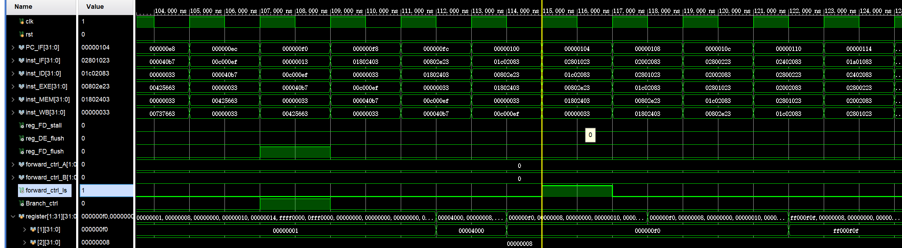

正确，forward_ctrl_ls为1，发生了正确的forward，并且此时没有发生stall


### 3.2 Predict-not-taken

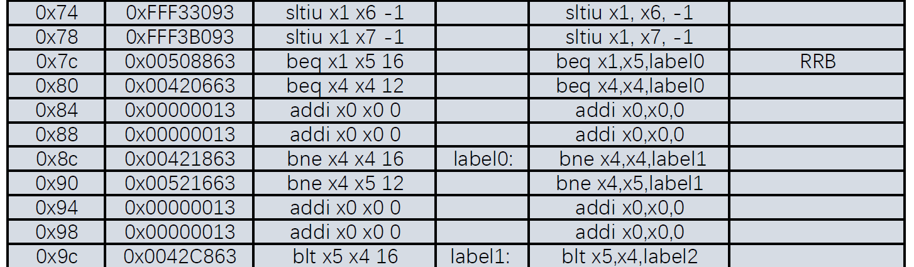

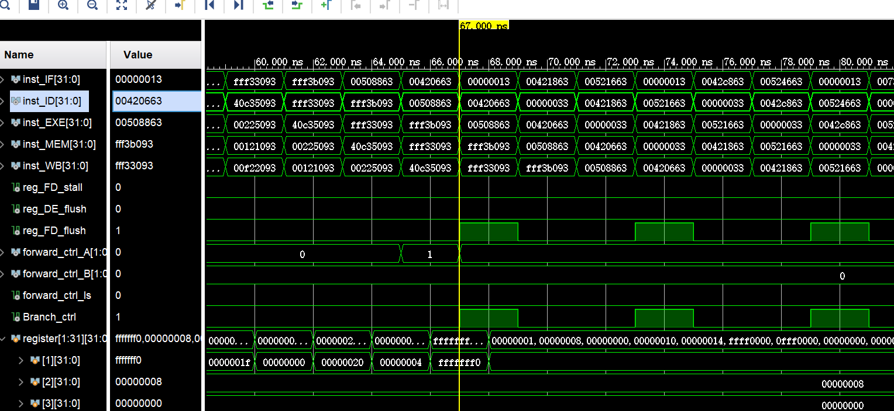


可以看到第一个beq是不会跳转的（x1和x5不一样）而第二个会跳转。前面提到过，branch的比较部件是放在ID阶段，所以我们去看ID阶段的指令，发现ID为第一个beq确实没有Branch_Ctrl，而第二个有，完全正确，并且也如预期的flush掉了IF/ID，IF阶段变成了我们自己填充的nop

（第一个branch这里还有一个小小的forward


附上所有仿真截图：

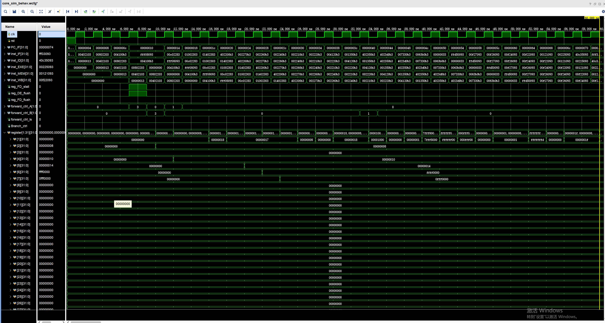

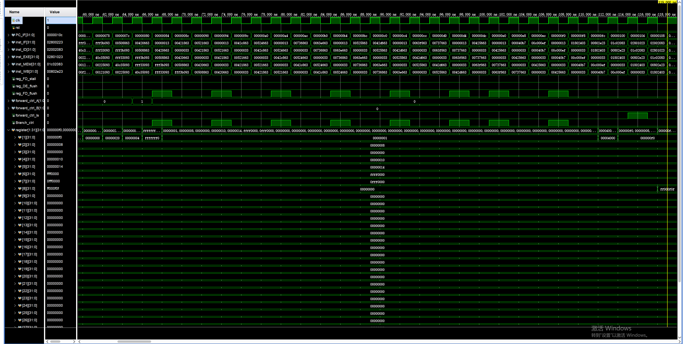

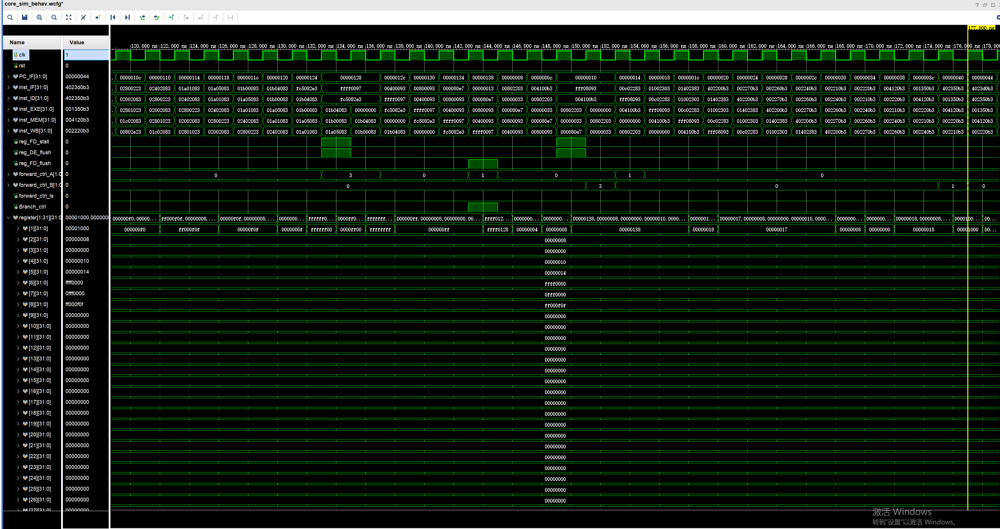

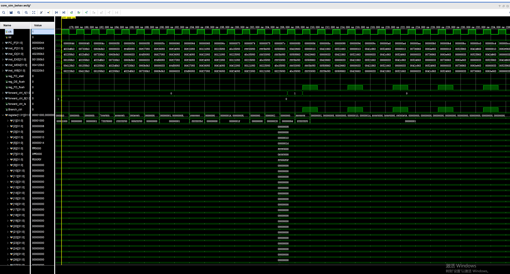

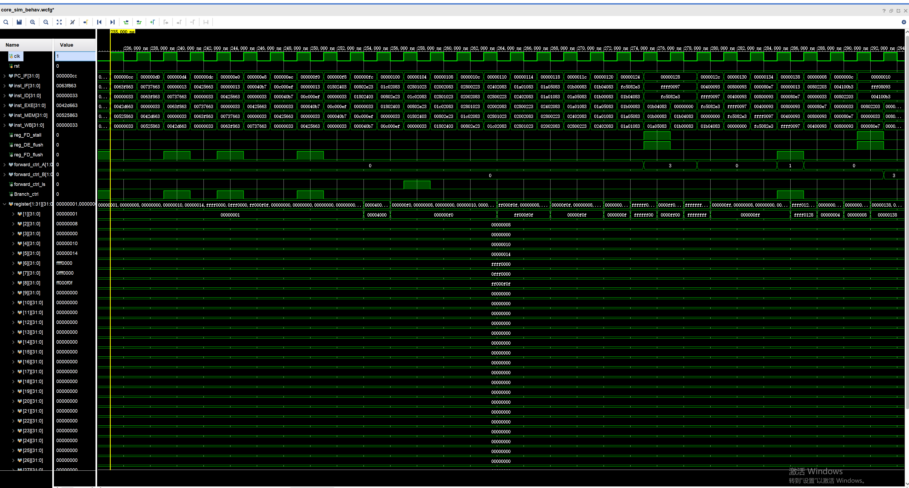

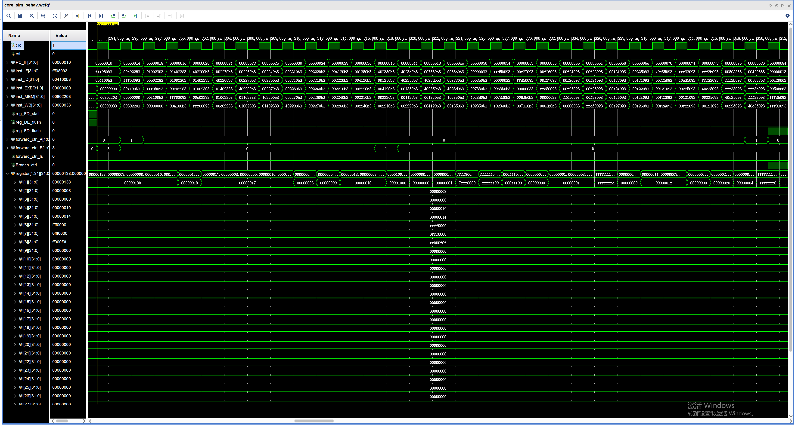

最后的线上验证正确

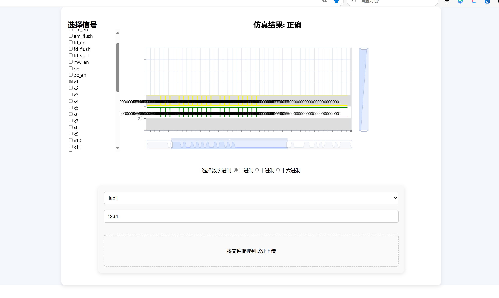

## 4. 讨论与心得

这次实验帮我很好的回顾了上学期计组里面学习的流水线cpu的知识，之前还有一些不是很懂，自己写的框架逻辑也不是非常的清晰，在理解上有阻碍。这次助教哥哥提供的框架思路非常清晰，并且ppt上有整一个连线图，能够让我更好的理解流水线cpu的工作原理、各种信号的传递，我对数据竞争时发生的stall与flush，控制竞争时发生的predict not taken与flush有了更好的理解，现在明白了只有load-use会触发stall，这个stall要阻止pc取值、阻止IF/ID寄存器写，并且还要清空ID/EX里的错误信息，而predict not taken只需要flush掉IF/ID里面刚刚取进来的错误的指令即可，另外，这个流水线的结构也有优化，把Hazard Detection和Branch Compare都放在了ID阶段，可以有效减小stall，另外，对reg也做了double bump处理

ps：个人觉得Hazard Detection模块的信号线可以再写的分开一些，之前ppt上那三种加上load-store的分开写，这样或许可以更方便理解。还有haza_optype_EX这种，其实就是alu load store这三种，一开始还没大理解，后来想了挺久才恍然大悟

总之这是一次很棒的实验体验，温故而知新，希望这学期在姜老师的体系结构这门课上会有更多的收获！！