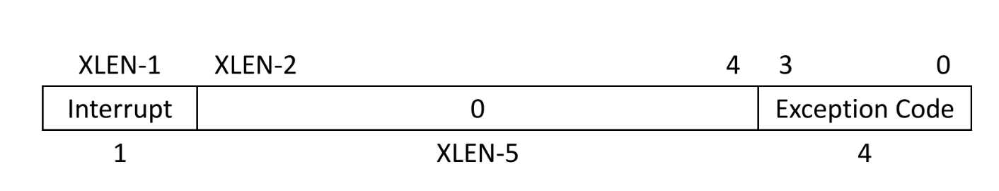
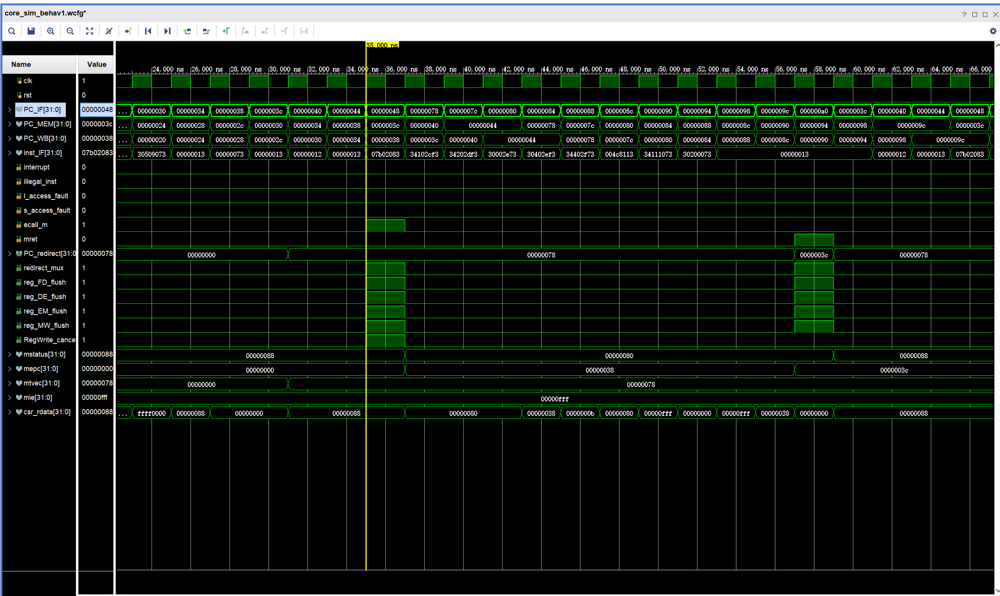
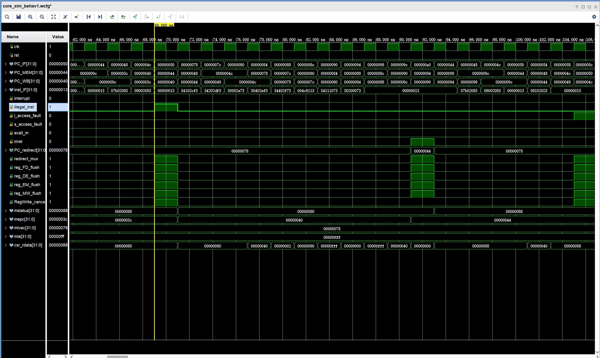
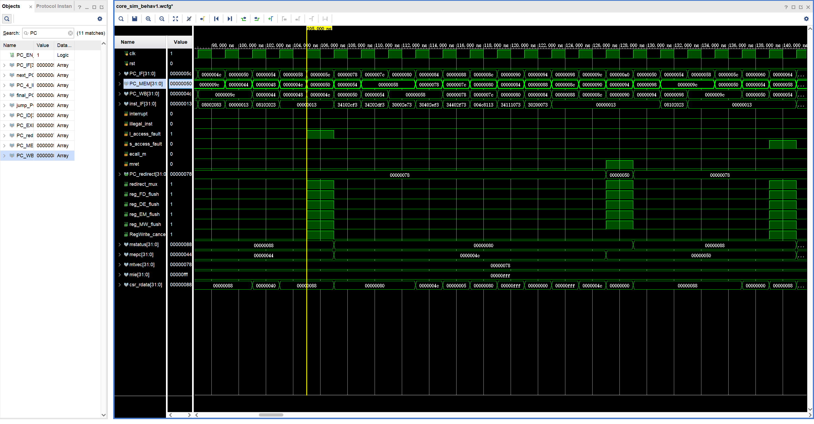
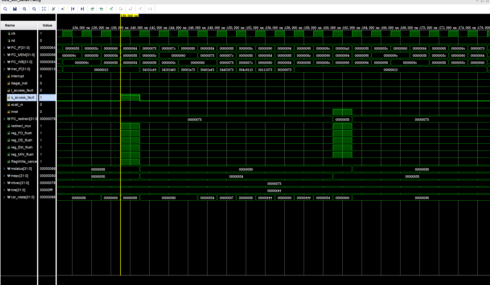
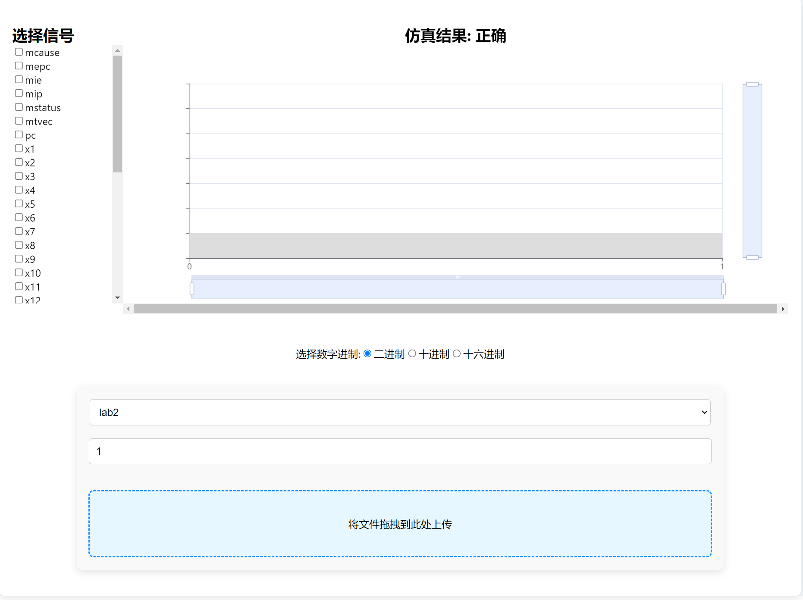

> 课程名称：计算机体系结构
>
> 实验类型：综合
>
> 实验项目名称：Lab2：支持中断的流水线CPU
>
> 学生姓名：杨正宇
>
> 专业：计算机科学与技术
>
> 学号：3220104117
>
> 同组学生姓名：
>
> 指导教师：姜晓红
>
> 实验日期：2024.10.10


## 1. 实验目的与要求

- 理解 CPU 异常和中断的原理及其处理程序，包括何时发生中断和异常，以及如何在硬件层面处理它们。

- 掌握支持异常和中断的流水线 CPU 的设计方法，以及跳转到异常处理程序的过程。

- 掌握支持异常和中断的流水线 CPU 的程序验证方法，包括使用仿真测试中断引发的信号和 CSR 寄存器的值。


## 2. 实验内容和原理
### 2.1 CtrlUnit模块实现
```verilog
    wire CSRRW = CSRop & funct3_1;
    wire CSRRS = CSRop & funct3_2;
    wire CSRRC = CSRop & funct3_3;
    wire CSRRWI = CSRop & funct3_5;
    wire CSRRSI = CSRop & funct3_6;
    wire CSRRCI = CSRop & funct3_7;
```
没什么好说，判断类型

```verilog
assign exp_vector = {illegal_inst, ECALL};
```
这是想判断异常的类型，在ExceptionUnit中有反映
```verilog
.illegal_inst(~isFlushed_WB & exp_vector_WB[3]),  //自定mode所代表的类型
        .ecall_m(~isFlushed_WB & exp_vector_WB[2]),
        .l_access_fault(~isFlushed_WB & exp_vector_WB[1]),
        .s_access_fault(~isFlushed_WB & exp_vector_WB[0]),
```


### 2.2 CSR模块实现
RISC-V 中外部中断必须通过 CSR 来开启，开启中断由两个步骤：

- mstatus[MIE] 是全局中断使能位，设置为 1 才会全局开启中断
- mie 寄存器中是针对各种中断类型的使能位，要将需要的位设置为 1
中断响应程序的入口地址由 mtvec 寄存器指定，如前面写到的，它分为两种模式：


当中断发生时，CPU 会：
- 将发生异常的指令（或下一条指令）的地址保存到 mepc 寄存器
- 将中断类型码保存到 mcause 寄存器
- 如果中断带有附加信息，将其保存到 mtval 寄存器
- 如果是外部引发的中断，令 mstatus[MPIE] = mstatus[MIE]（保存），然后令 mstatus[MIE] = 0（关闭中断）
- 将当前特权模式保存到 mstatus[MPP] 中
- 将当前特权模式设置为 Machine 模式
- 根据 mtvec 寄存器的设置，跳转到对应中断响应程序

对映代码如下：
```verilog
else if(interrupt) begin
            CSR[0][7] <= CSR[0][3];  //MPIE存上次的MIE
            CSR[0][3] <= 0;  //MIE设为0，禁止中断
            CSR[9] <= mepc_w;      //写入mepc
            CSR[10] <= mcause_w;  //写入mcause
            CSR[11] <= mtval_w;  //写入mtval
```

中断处理结束后要使用 mret 指令进行返回，它会：
- 令 mstatus[MIE] = mstatus[MPIE]（恢复），然后令 mstatus[MPIE] = 1
- 将当前特权模式设置为 mstatus[MPP] 中保存的值
- 将 mstatus[MPP] 设置为 U 模式
- 将 pc 值设置为 mepc 值，即跳转回中断前的程序

对映代码如下：
```verilog
else if(mret) begin
            CSR[0][3] <= CSR[0][7];  //MIE设置成MPIE
            CSR[0][7] <= 1;  //MPIE
```

关于那六条会对特权寄存器进行操作的指令：
```verilog
else if(csr_w) begin
            case(csr_wsc_mode)
                2'b01: CSR[waddr_map] <= wdata; //TO_BE_FILLED;
                2'b10: CSR[waddr_map] <= CSR[waddr_map] | wdata; //TO_BE_FILLED;
                2'b11: CSR[waddr_map] <= CSR[waddr_map] & ~wdata;  //TO_BE_FILLED;
                default: CSR[waddr_map] <= wdata;
            endcase            
        end
```

CSR 指令都使用 I 型指令，其中 12 位的立即数部分表示 CSR 的地址，funct3 低 2 位用来编码读 / 改 / 写（read-modify-write）操作、高 1 位表示是否来自立即数（如果来自立即数则 rs1 部分表示一个 5 位无符号立即数），opcode 都是 SYSTEM（1110011）。

这里的csr_w就是CtrlUnit的csr_rw信号，也就是那六条csr指令的或
```verilog
CSRRW | CSRRS | CSRRC | CSRRWI | CSRRSI | CSRRCI
```
意思是只要确定opcode是CSR指令就会对CSR寄存器有操作


### 2.3 ExceptionUnit模块实现
异常指令的一些参考：https://soc.ustc.edu.cn/CECS/lab4/intro/

```verilog
assign exception_index = illegal_inst && 4'b0010 | l_access_fault && 4'b0101 | s_access_fault && 4'b0111 | ecall_m && 4'b1011;
```
查阅手册，找到mcause中对映异常类型的编码



```verilog
assign mcause_w = {interrupt,{27{1'b0}},exception_index};
```


```verilog
assign interrupt_or_exception = interrupt | illegal_inst | l_access_fault | s_access_fault | ecall_m;
    //中断是要当前指令执行完毕，而异常是要立即停止当前指令
    assign reg_FD_flush = interrupt_or_exception | mret;   //mret是在ID阶段得到，他的下一条指令进入了IF，需要被冲刷掉
    assign reg_DE_flush = interrupt_or_exception;   //TO_BE_FILLED;
    assign reg_EM_flush = interrupt_or_exception;   //TO_BE_FILLED;
    assign reg_MW_flush = interrupt_or_exception;   //TO_BE_FILLED;
    assign RegWrite_cancel = interrupt_or_exception;  //TO_BE_FILLED;
```

有点类似于之前的predict-not-taken

在中断异常处理中，一旦出现了中断或者异常，要把这条指令后面的全部flush掉，避免执行错误指令


```verilog
//PC跳转
    assign redirect_mux = interrupt_or_exception | mret;  //TO_BE_FILLED;  //1的时候是异常处理的pc，0的时候是IF阶段的
    assign PC_redirect = mret ? mepc : mtvec;   //TO_BE_FILLED;  ret的时候，PC跳转到mepc，中断和异常的时候跳转到mvec
```
当中断结束的时候，pc应该为mepc，但是如果是进入中断，是要去向量表

```verilog
assign mepc_w = interrupt ? epc_next : epc_cur;  //异常时，mepc保存的是异常的指令；中断时，mepc保存的是下一条指令
```

## 3. 实验过程和数据记录以及结果分析

### ECALL

PC=38的时候遇到ecall指令，可以看到在PC_WB=38以后，下一周期PC的取值变成78，即进入trap，另外mepc、mstatus、mtvec也都正常赋值



在处理程序的最后会遇到mret，之后pc被重定向到下一条指令继续执行


### Illeagal



pc=40的时候，exceptUnit拿到信息，然后在下个阶段重定向到trap入口进行操作

同样的，当跑完trap部分遇到94的mret的时候，redirect_mux为1，重定向到mepc的内容，回到44继续执行


### l_access_fault



完全同理，4C的时候进入中断，然后出来的时候定位到50


### s_access_fault




同上，不做赘述


### 线上测试




## 4. 讨论与心得

通过这次实验，对riscv中的中断与异常处理有了更好的理解。上学期只是做了scpu的中断，这学期将其加到五级流水线上，实现了知识的融汇贯通。非常感谢助教哥哥详细而清晰的代码框架，让我受益颇多！