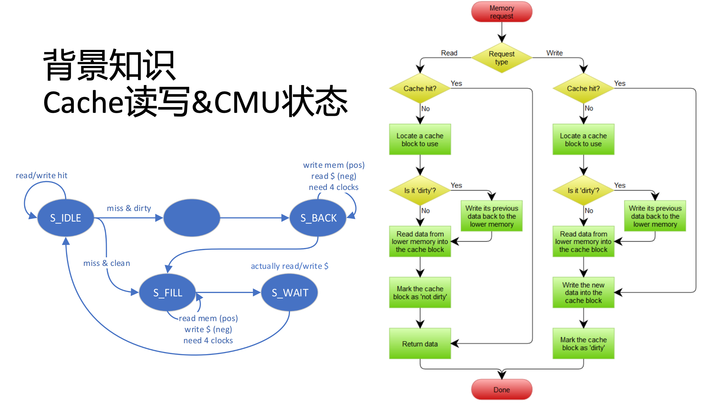

> 课程名称：计算机体系结构
>
> 实验类型：综合
>
> 实验项目名称：Lab3&4：Pipelined CPU with Cache
>
> 学生姓名：杨正宇
>
> 专业：计算机科学与技术
>
> 学号：3220104117
>
> 同组学生姓名：
>
> 指导教师：姜晓红
>
> 实验日期：2024.11.1

## 1. 实验目的
- 理解Cache中Tag, Valid, Dirty的作用和Least Recently Used的概念
- 理解Cache Management Unit的作用及与CPU结合的方法
- 理解CMU的各种State，以及处理Hit，Miss等状况的方法
- 掌握验证Cache和CMU设计正确性的方法


## 2. 实验步骤
这次实验的cache结构如下：
```
// | ----------- address 32 ----------- |
// | tag 23 | index 5 | word 2 | byte 2 |
```

一个word是32bit，即4B，所以WORD_BYTES_WIDTH = 2
ELEMENT_WORDS = 4，意味着每个cache line有4个word，所以有一个ELEMENT_WORDS_WIDTH = 2
因此，一个block的宽度就是2+2=4bit
实验规定一共有有64个cache line，2-way associative，因此index是5bit

### 2.1 cache.v的实现
#### cache的内部信号
```verilog
reg [31:0] inner_data [0:ELEMENT_NUM*ELEMENT_WORDS-1];
```
这是指一共有ELEMENT_NUM*ELEMENT_WORDS个32bit的word  64 * 4 = 256

```verilog
    wire [TAG_BITS-1:0] addr_tag;
    wire [SET_INDEX_WIDTH-1:0] addr_index;     // idx of set
    wire [ELEMENT_WORDS_WIDTH+WORD_BYTES_WIDTH-WORD_BYTES_WIDTH-1:0] addr_word; //word的具体地址 2bit，4个word到底取出哪一个
    wire [ELEMENT_INDEX_WIDTH-1:0] addr_element1;  
    wire [ELEMENT_INDEX_WIDTH-1:0] addr_element2;     
    wire [ELEMENT_INDEX_WIDTH+ELEMENT_WORDS_WIDTH-1:0] addr_word1; // element index + word index 8bit
    wire [ELEMENT_INDEX_WIDTH+ELEMENT_WORDS_WIDTH-1:0] addr_word2; 

    assign addr_tag = addr[ADDR_BITS-1:ADDR_BITS-TAG_BITS];  //输入
    assign addr_index = addr[ADDR_BITS - TAG_BITS - 1:ADDR_BITS - TAG_BITS - SET_INDEX_WIDTH]   //TO_BE_FILLED;
    assign addr_word = addr[ELEMENT_WORDS_WIDTH + WORD_BYTES_WIDTH - 1:WORD_BYTES_WIDTH];   //TO_BE_FILLED;

    assign addr_element1 = {addr_index, 1'b0};
    assign addr_element2 = {addr_index, 1'b1};       //选哪一个块，即哪一个way
    assign addr_word1 = {addr_element1, addr_word};  //选具体的word
    assign addr_word2 = {addr_element2, addr_word};           

    assign word1 = inner_data[addr_word1];
    assign word2 = inner_data[addr_word2]; 
```

addr_element1是根据index找出了组，但是因为是二路组关联，每个set有两个cache line，因此后面附加了1bit来判断是哪个way
addr_word1是cache line里面具体的word地址，指单单的一个word，其前面的部分是addr_element1，即取index对映的组的0号cache line，后面的addr_word是一个2bit的东西，代表取出具体哪一个word

```verilog
    assign recent1 = inner_recent[addr_element1];
    assign recent2 = inner_recent[addr_element2];  
    assign valid1 = inner_valid[addr_element1];
    assign valid2 = inner_valid[addr_element2];   
    assign dirty1 = inner_dirty[addr_element1];
    assign dirty2 = inner_dirty[addr_element2] ;   
    assign tag1 = inner_tag[addr_element1];
    assign tag2 = inner_tag[addr_element2];     
    assign hit1 = valid1 & (tag1 == addr_tag);
    assign hit2 = valid2 & (tag2 == addr_tag) ; 
```
因为有64个cache line，即addr_element bit，recent valid dirty是每个cache line的相关控制信号

#### cache的输出信号
由于运用了lru替换策略，所以传出的应该是旧的块的值，所以当recent是1号块的时候，应该传出2号块的valid dirty tag值
```verilog
    always @ (*) begin
        valid <= hit1 ? valid1 : hit2 ? valid2 : recent1 ? valid2 : valid1; //TO_BE_FILLED; // if both not hit, set to the recent value
        dirty <= hit1 ? dirty1 : hit2 ? dirty2 : recent1 ? dirty2 : dirty1;  //TO_BE_FILLED; // if both not hit, set to the recent value
        tag <= hit1 ? tag1 : hit2 ? tag2 : recent1 ? tag2 : tag1;     //TO_BE_FILLED; // if both not hit, set to the recent value
        hit <= hit1 | hit2;
        if (load & hit1) begin
            dout <= u_b_h_w[1] ? word1 :
            u_b_h_w[0] ? {u_b_h_w[2] ? 16'b0 : {16{half_word1[15]}}, half_word1} :
            {u_b_h_w[2] ? 24'b0 : {24{byte1[7]}}, byte1};
        end
        else if (load & hit2) begin
            dout <= u_b_h_w[1] ? word2 :
            u_b_h_w[0] ? {u_b_h_w[2] ? 16'b0 : {16{half_word2[15]}}, half_word2} :
            {u_b_h_w[2] ? 24'b0 : {24{byte1[7]}}, byte2};
        end
        else begin //read miss
            dout <= recent1 ? word2 : word1;  //如果第一路是最新用的，就把第二路的丢出去
        end
    end
```
这里也处理了输出数据的情况，read hit的时候就是把word1和word2给到cpu，如果是read miss的时候就要根据lru策略进行替换了，把旧的替换出去

#### cache line相关信号的设置

##### read hit
```verilog
if (load) begin  //read
    if (hit1) begin
        // inner_recent[TO_BE_FILLED] <= TO_BE_FILLED;
        // inner_recent[TO_BE_FILLED] <= TO_BE_FILLED;

        inner_recent[addr_element1] <= 1'b1;
        inner_recent[addr_element2] <= 1'b0;
    end
    else if (hit2) begin
        // inner_recent[TO_BE_FILLED] <= TO_BE_FILLED;
        // inner_recent[TO_BE_FILLED] <= TO_BE_FILLED;

        inner_recent[addr_element1] <= 1'b0;
        inner_recent[addr_element2] <= 1'b1;  
    end
end
```
read hit只需要修改recent位就可以了

##### write hit
```verilog
if (store) begin  //write
    if (hit1) begin
        inner_data[addr_word1] <= u_b_h_w[1] ? din
            : u_b_h_w[0] ? addr[1] ? {din[15:0], word1[15:0]} : {word1[31:16], din[15:0]} 
                :addr[1] ? addr[0] ? {din[7:0], word1[23:0]} : {word1[31:24], din[7:0], word1[15:0]}
                    :addr[0] ? {word1[31:16], din[7:0], word1[7:0]} : {word1[31:8], din[7:0]};

        inner_dirty[addr_element1] <= 1'b1;
        inner_recent[addr_element1] <= 1'b1;
        inner_recent[addr_element2] <= 1'b0;
    end
    else if (hit2) begin
        inner_data[addr_word2] <= u_b_h_w[1] ? din
            :u_b_h_w[0] ? addr[1] ? {din[15:0], word2[15:0]} : {word2[31:16], din[15:0]} 
                :addr[1] ? addr[0] ? {din[7:0], word2[23:0]} : {word2[31:24], din[7:0], word2[15:0]}
                    :addr[0] ? {word2[31:16], din[7:0], word2[7:0]} : {word2[31:8], din[7:0]};

        inner_dirty[addr_element2] <= 1'b1;
        inner_recent[addr_element1] <= 1'b0;
        inner_recent[addr_element2] <= 1'b1;
    end
end
```
写的情况比读的情况要多设置一个dirty bit

#### miss之后的替换
```verilog
if (replace) begin
    if (hit2 | ((~hit1) & recent1)) begin
        inner_data[addr_word2] <= din; //替换2
        inner_valid[addr_element2] <= 1'b1;
        inner_dirty[addr_element2] <= 1'b0;
        inner_tag[addr_element2] <= addr_tag;
        inner_recent[addr_element1] <= 1'b0;
        inner_recent[addr_element2] <= 1'b1;         
    end else begin
        inner_data[addr_word1] <= din;
        // inner_valid[TO_BE_FILLED] <= TO_BE_FILLED;
        // inner_dirty[TO_BE_FILLED] <= TO_BE_FILLED;
        // inner_tag[TO_BE_FILLED] <= addr_tag;
        // inner_recent[TO_BE_FILLED] <= TO_BE_FILLED;
        // inner_recent[TO_BE_FILLED] <= TO_BE_FILLED; 

        inner_valid[addr_element1] <= 1'b1;
        inner_dirty[addr_element1] <= 1'b0;
        inner_tag[addr_element1] <= addr_tag;
        inner_recent[addr_element1] <= 1'b1;
        inner_recent[addr_element2] <= 1'b0;       
    end
end
```
我们会遇到read miss，也会遇到write miss，对于read miss，我们需要把block拿到cache里面再读，而write miss时，因为我们用了write allocate，所以也是要把东西先拿到cache里面，这时会发生替换的问题，这一模块就是结合了lru来处理替换的情况


### 2.2 cmu控制模块的实现

我们根据状态图实现状态机即可

#### IDLE
##### State Ctrl
```verilog
S_IDLE: begin
    if (en_r || en_w) begin
        if (cache_hit)
            next_state = S_IDLE;  //TO_BE_FILLED;
        else if (cache_valid && cache_dirty)
            next_state = S_BACK; //miss & dirty;
        else
            next_state = S_FILL; //miss & clean;
    end
    else begin
        next_state = S_IDLE; //TO_BE_FILLED;
    end
    next_word_count = 2'b00;
end
```
这个状态比较简单如果是read hit或者是write hit，那么依然会停留在这个状态进行常规的读写

##### Cache Ctrl
```verilog
S_IDLE, S_WAIT: begin
    cache_addr = addr_rw;
    cache_load = en_r;
    cache_store = en_w;
    cache_replace = 1'b0;
    cache_u_b_h_w = u_b_h_w;
    cache_din = data_w;
end
```
进行cache的读写

##### Mem Ctrl
```verilog
S_IDLE, S_WAIT: begin
    mem_cs_o = 1'b0;
    mem_we_o = 1'b0;
    mem_addr_o = 32'b0;
end
```

#### BACK   
##### State Ctrl
```verilog
S_BACK: begin
    if (mem_ack_i && word_count == {ELEMENT_WORDS_WIDTH{1'b1}})    // 2'b11 in default case
        next_state = S_FILL; //TO_BE_FILLED;
    else
        next_state = S_BACK; //TO_BE_FILLED;

    if (mem_ack_i)
        next_word_count = word_count+1;
    else
        next_word_count = word_count;
end
```
{ELEMENT_WORDS_WIDTH{1'b1}}指把`1'b1`重复ELEMENT_WORDS_WIDTH次，即2'b11
我们一个block是4个word，这里是要把一整个block的4个word读完才可以

##### Cache Ctrl
```verilog
S_BACK: begin
    cache_addr = {addr_rw[ADDR_BITS-1:BLOCK_WIDTH], word_count, {ELEMENT_WORDS_WIDTH{1'b0}}}; //TO_BE_FILLED;
    cache_load = 1'b0;
    cache_store = 1'b0;
    cache_replace = 1'b0;
    cache_u_b_h_w = 3'b010;
    cache_din = 32'b0;
end
```

##### Mem Ctrl
```verilog
S_BACK: begin
    mem_addr_o = {cache_tag, addr_rw[ADDR_BITS-TAG_BITS-1:BLOCK_WIDTH], word_count, {ELEMENT_WORDS_WIDTH{1'b0}}};
    mem_cs_o = 1'b1;
    mem_we_o = 1'b1;
end
```

#### FILL
##### State Ctrl
```verilog
S_FILL: begin
    if (mem_ack_i && word_count == {ELEMENT_WORDS_WIDTH{1'b1}})
        next_state = S_WAIT; //TO_BE_FILLED;
    else
        next_state = S_FILL; //TO_BE_FILLED;

    if (mem_ack_i)
        next_word_count = word_count+1;
    else
        next_word_count = word_count;
end
```
这一部分进行了读mem的操作，不断把mem的数据读近cache，在read miss的时候需要把mem的数据加入到cache；在write miss的时候也是一样，先把mem的block写入到cache中再进行写操作

##### Cache Ctrl
```verilog
S_FILL: begin
    cache_addr = {addr_rw[ADDR_BITS-1:BLOCK_WIDTH], word_count, {ELEMENT_WORDS_WIDTH{1'b0}}}; //TO_BE_FILLED;
    cache_load = 1'b0;
    cache_store = 1'b0;
    cache_replace = mem_ack_i;
    cache_u_b_h_w = 3'b010;
    cache_din = mem_data_i;
end
```

#### WAIT
##### State Ctrl
```verilog
S_WAIT: begin
    next_state = S_IDLE; //TO_BE_FILLED;
    next_word_count = 2'b00;
end
```

##### Cache Ctrl
同IDLE阶段，进行实际的读写

##### Mem Ctrl
同IDLE阶段


#### 暂停信号
```verilog
assign stall = next_state != S_IDLE; //TO_BE_FILLED;
```
只要下一个阶段不是IDLE说明还在mem和cache之间沟通数据，应该停下来等他们

